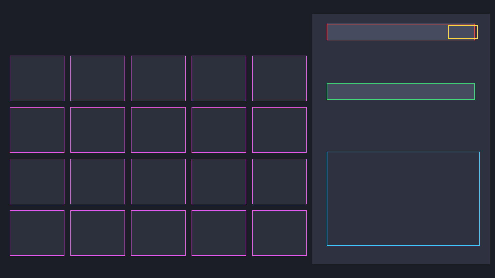

<h1 align="center">Tethys</h1>

<p align="center">
  <b>A fast, native echo build optimizer for Wuthering Waves.</b><br>
  Scan your echoes off the screen, get the mathematically best build in a second.
</p>

<p align="center">
  <a href="https://github.com/Hung1510/tethys/actions"></a>
  
  
</p>

---

## Why

The community's go-to open-source optimizer, [WuWaOpt](https://github.com/EMCJava/WuWaOpt), was **archived and left unmaintained after patch 2.1**. Most of what remains is web-based. There isn't a maintained, native desktop tool that does the whole loop - read your echoes off the screen and optimize them - in one place. Tethys is that tool.

## What it does

- **Scan** your echo inventory straight from the game via screen capture + OCR - no manual data entry.
- **Optimize** your five-echo build (the fixed `4-3-3-1-1` cost layout) for a given character, respecting set bonuses and main-stat preferences.
- **Explain** the result: which echoes, why, and how the build scores.

### Status

| Piece | State |
|---|---|
| Optimizer core (genetic + exhaustive solvers) | ✅ done, tested |
| OCR-text → stats parser | ✅ done, tested |
| Inventory import/export (JSON) | ✅ done |
| Command-line interface | ✅ done, runnable |
| Capture-region detection (16:9 fit + calibration overlay) | ✅ done, tested |
| Inventory-grid detection + tile batch-scan | ✅ done, tested |
| Landing page + SEO (structured data, sitemap, OG) | ✅ done |
| Screen capture (xcap window grab) | 🟡 wired, behind `capture` feature |
| Windows OCR backend (`Windows.Media.Ocr`, no install) + `scan` command | ✅ done, behind `windows-ocr` feature |
| Tesseract OCR backend | 🟡 wired, behind `tesseract` feature |
| Desktop GUI (egui) - load inventory, pick profile, optimize | ✅ works, behind `gui` feature |
| Prebuilt Windows binary (GitHub Release on tag) | ✅ done |
| Damage-formula evaluator | 🔜 roadmap |
| Shorekeeper-themed skin | 🔜 roadmap |

## Download

Grab the latest Windows build from the [Releases page](https://github.com/Hung1510/tethys/releases) - unzip and run `tethys.exe`. Double-clicking opens the GUI; the same binary also has the CLI subcommands below.

> Because the binary isn't code-signed yet, Windows SmartScreen/Defender may warn on first run ("Windows protected your PC"). Click **More info → Run anyway**.

## Quick start

```bash
git clone https://github.com/Hung1510/tethys
cd tethys

# Run the optimizer on the bundled sample inventory:
cargo run --release -p tethys-app -- optimize sample_inventory.json --profile dps

# Restrict to a five-piece set:
cargo run --release -p tethys-app -- optimize sample_inventory.json --set SunSinkingEclipse

# See the exact optimum via brute force (small inventories only):
cargo run --release -p tethys-app -- optimize sample_inventory.json --method exhaustive

# Print the inventory JSON schema:
cargo run --release -p tethys-app -- sample
```

Example output:

```
Recommended build (genetic solver)
  score:       13.690
  evaluations: 30000

  [4-cost] SunSinkingEclipse | main: CritDmg 44.0% | CritRate 9.0%, AtkPct 8.6%
  [3-cost] SunSinkingEclipse | main: Fusion 30.0% | CritRate 10.5%, CritDmg 21.0%
  [3-cost] SunSinkingEclipse | main: AtkPct 30.0% | CritDmg 14.7%
  [1-cost] SunSinkingEclipse | main: AtkPct 18.0% | CritRate 9.0%, CritDmg 18.0%
  [1-cost] MoltenRiftEmbers  | main: AtkPct 18.0% | CritDmg 12.6%
```

### Enabling capture, OCR, and the GUI

```bash
# Read the open echo panel (screen capture + built-in Windows OCR, no install):
cargo run -p tethys-app --features capture,windows-ocr -- scan
# Desktop GUI:
cargo run -p tethys-app --features gui -- gui
# Tesseract OCR instead of Windows OCR (needs libtesseract installed):
cargo build -p tethys-scanner --features tesseract
```

`scan` captures the game window, locates the echo detail panel, and reads a complete echo - set, cost, main stat, and substats - with the OS's built-in `Windows.Media.Ocr` engine (no Tesseract or other install). Each scan appends the echo to an inventory file (default `inventory.json`), so the workflow is: select an echo in-game → `tethys scan` → repeat → `tethys optimize inventory.json`. If a field can't be read, `scan` says which and points you to `calibrate` to align the regions.

> On Windows the game runs elevated, so Tethys must run elevated for capture to see its window. Set Windows display scaling to 100% for the scan regions to line up (the scanner works in physical pixels). Windows OCR uses the English language feature - installed by default on most systems; if `scan` reports no OCR engine, add it under Settings → Time & language → Language → English → Optional features.

### Finding the echo panel on screen (capture-region detection)

Hardcoded pixel coordinates break the moment someone plays on an ultrawide monitor, a 16:10 laptop, or in a resized window. Tethys handles this properly: it captures the **game window** (by title, so window position and overlapping windows don't matter), computes the **16:9 content rectangle** inside it - skipping any letterbox/pillarbox bars - and places each UI region as a fraction of that content area. All of that maths is pure and unit-tested against exact-16:9, ultrawide, and 16:10 shapes.

To line the regions up with the live UI there's a calibration overlay:

```bash
# With the game open on an echo, save an annotated screenshot:
cargo run -p tethys-app --features capture -- calibrate cal.png
```

`cal.png` is your screenshot with colored boxes drawn where Tethys thinks each field is - red = name, amber = cost, green = main stat, cyan = substats, purple = set. If a box is off, nudge the fractions in `EchoDetailLayout::default_16_9()` (`crates/scanner/src/layout.rs`) and re-run. Here is the overlay on a mock 1080p frame:

<p align="center"></p>

### Batch-scanning the inventory grid

The same content-relative geometry extends from one panel to the whole inventory page. `GridLayout` tiles the grid area into per-cell rectangles (row-major), and `scan_grid_tiles` crops and OCRs every tile in one pass - inheriting the letterbox/pillarbox handling for free. Add `--grid` to the calibrate command to overlay the cells (magenta) alongside the detail-panel boxes:

```bash
cargo run -p tethys-app --features capture -- calibrate cal.png --grid
```

Inventory tiles show a summary (main stat, level), so the grid scan is for fast triage across a page; reading an echo's full substats still uses the detail-panel scan. By design Tethys only reads the screen - it never clicks or pages through the grid for you, to stay firmly on the right side of the game's terms.

## How it works

```
        ┌──────────────┐   pixels   ┌───────────┐   text    ┌─────────────┐
 game → │   capture    │ ─────────► │    OCR    │ ────────► │  parse.rs   │
        │ (xcap)       │            │ (tess/win)│           │ (pure/tested)│
        └──────────────┘            └───────────┘           └──────┬──────┘
                                                                   │ typed stats
                                                                   ▼
        ┌──────────────────────────────────────────────────────────────┐
        │  tethys-core: model → score (Evaluator) → optimizer (GA)       │
        └──────────────────────────────────────────────────────────────┘
                                                                   │
                                                                   ▼
                                                            recommended build
```

The workspace is split so the interesting logic stays testable:

- **`tethys-core`** - domain model, scoring, and the optimizer. No I/O, no platform code, fully unit-tested on any OS.
- **`tethys-scanner`** - capture-region detection (pure, tested), screen capture, and OCR. The window grab and OCR backends are behind feature flags so the default build is pure Rust.
- **`tethys-app`** - the CLI and the (feature-gated) egui GUI.

### The optimizer

Choosing the best five echoes is a combinatorial problem: for a heavily-farmed account there can be hundreds of candidates per slot. Tethys ships two solvers behind one interface:

- A **genetic algorithm** (`optimize_ga`) - the general solver. Genome = one echo choice per slot; fitness = the character's weighted roll-value score; tournament selection, uniform crossover, mutation, elitism, and a repair step that keeps builds valid (no echo used twice).
- An **exhaustive solver** (`optimize_exhaustive`) - brute-forces every valid combination and returns the *provable* optimum. It refuses to run above a combination cap, so it's used for small inventories and, crucially, **as the oracle the GA is tested against**:

```rust
// From the test suite - the GA must reach the brute-forced optimum.
let truth = optimize_exhaustive(&inv, &spec, &eval, 10_000_000).unwrap();
let ga    = optimize_ga(&inv, &spec, &eval, &GaConfig::default()).unwrap();
assert!((truth.score - ga.score).abs() < 1e-4);
```

Scoring is behind an `Evaluator` trait. v1 ships a weighted-substat evaluator (the standard "roll value" model); a damage-formula evaluator can be added without touching the optimizer.

## Inventory format

Echoes are plain JSON, so you can import from a screen scan or hand-edit:

```json
{
  "echoes": [
    {
      "id": 1,
      "name": "Lampylumen Myriad",
      "set": "SunSinkingEclipse",
      "cost": 4,
      "level": 25,
      "main_stat": { "stat": "CritDmg", "value": 44.0 },
      "substats": [
        { "stat": "CritRate", "value": 9.0 },
        { "stat": "AtkPct",   "value": 8.6 }
      ]
    }
  ]
}
```

## Maintainer note on game data

Patch-specific numbers (substat roll ceilings, main-stat pools, set names) live in **one file**, `crates/core/src/data.rs`. When Kuro rebalances echoes, update that file and bump the `PATCH` constant - nothing else should need to change.

## Roadmap

- [x] Windows.Media.Ocr backend (no external install, handles the game font well)
- [ ] Damage-formula evaluator using character base stats
- [x] Locate the echo panel across window shapes (16:9 fit + calibration overlay)
- [x] Extend region detection to the echo *grid* - tile geometry + per-tile batch scan
- [ ] Navigation helper to page through the grid (screen-read only; no input automation)
- [ ] Per-character weight profiles from a community-maintained data file
- [ ] Shorekeeper-themed GUI skin
- [ ] Signed release binaries (unsigned Rust builds trip Windows Defender)

## Contributing

Issues and PRs welcome - especially tuned character profiles and verified patch data. The core has no platform dependencies, so `cargo test --workspace` runs anywhere.

## Disclaimer

A fan-made tool, not affiliated with or endorsed by Kuro Games. Wuthering Waves and all related assets are property of Kuro Games. Tethys only reads values from your own screen; it does not modify, inject into, or automate the game.

## License

MIT - see [LICENSE](LICENSE).